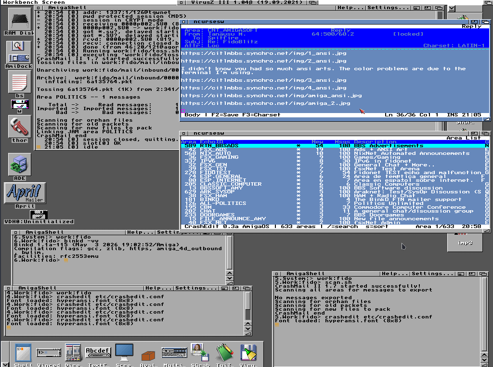
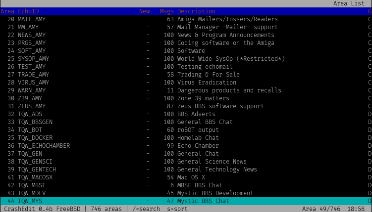
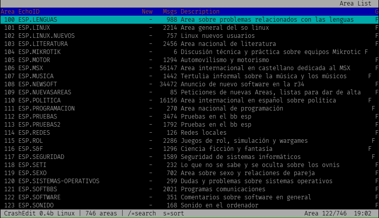

                                 CrashMail II

                             The Next Generation!

                      ...a stranger in a strange land...


Added AmigaOS 3.2 support and crashedit an editor to jamlib using jamlib.a from crashmail.
Crashedit based on golded+ but with basic functionalities: area, messages, reader and editor, plus an ansi art viewer and file request.

Added tag "aso" to crashmail config file to work in aso mode.

```
**For CrashEdit documentation, see [crashedit/README.md](crashedit/README.md)**
**For CrashEdit documentation in Spanish, see [crashedit/README_ESP.md](crashedit/README_ESP.md)**
```

This project was inspired by Golded+ [https://github.com/golded-plus/golded-plus]. While it served as a reference during development, the implementation in this repository was written independently and does not contain code copied from the original project.

============
Introduction
============
Welcome to CrashMail II! CrashMail II is basically a more portable version
of CrashMail, a tosser for Amiga computers. Users of the old Amiga
version will probably find some things familiar while some features are
gone such as the ARexx port (for obvious reasons!) and the GUI
configuration editor. The only feature that CrashMail II has and the old
CrashMail hasn't is support for JAM messagebases.

Homepage:   http://ftnapps.sourceforge.net/crashmail.html
Code:       http://sourceforge.net/p/ftnapps/crashmail/code/
Downloads:  http://sourceforge.net/projects/ftnapps/files/crashmail/


=========
Copyright
=========

Copyright (C) 1998-2004, Johan Billing <billing@df.lth.se>
Copyright (C) 1999-2010, Peter Krefting <peter@softwolves.pp.se>
Copyright (C) 2009-2016, Robert James Clay <jame@rocasa.us>
Copyright (C) 2016-2016, Lars Kellogg-Stedman <lars@oddbit.com>
Copyright (C)      2016, Niklas Lindholm <niklas@nilin.se>

JAMLIB is copyright (c) 1999 Björn Stenberg. JAMLIB is released under the
GNU Lesser General Public License, See src/jamlib/jamlib.doc for more
information.

tests/roundup is copyright (c) 2010 Blake Mizerany - MIT License

Except where explicitly stated otherwise, all other parts of CrashMail are
copyright 1998-2004 Johan Billing. Permission to use, copy and distribute
CrashMail is granted provided that this copyright notice is included. Permission
to modify CrashMail is granted. Distributing modified versions of CrashMail is
allowed provided that the documentation clearly states that it is a modified
version. Parts of CrashMail may be freely used in other projects as long as
the documentation mentions the original copyright holder.


================
Acknowledgements
================
Many thanks to Björn Stenberg for creating the excellent subroutine library
JAMLIB which CrashMail uses for handling JAM messagebases.

Thanks for Peter Karlsson for porting CrashMail II to OS/2 and the man pages.

Thanks to Lars Kellogg-Stedman for the testing scripts as well as the other
improvements he has made.


=============
Documentation
=============
The documentation is very brief and CrashMail probably isn't the ideal
choice for Fidonet beginners. All documentation of the available keywords
in the configuration file can be found in the doc/example.prefs file, and
other information can be found in the doc/ReadMe.txt file..


=========
Platforms
=========
This version of CrashMail can be compiled for Win32, Linux and OS/2; see the
INSTALL file for details. If you are interested in running CrashMail on another
platform, please contact me if you are willing to do the work necessary to adapt
CrashMail to your platform. The amount of work required mostly depends on whether
your C-compiler supports some common POSIX-functions which CrashMail uses.

=========
CrashEdit
=========

CrashEdit is a full-featured FTN (FidoNet) message reader and editor with UTF-8 support, inspired by Golded+. It includes area management, message reading/writing, ANSI art viewer, file requester, spell checker, hyphenation, thesaurus, and translation capabilities.

**Documentation:**
- English: [crashedit/README.md](crashedit/README.md)
- Spanish: [crashedit/README_ESP.md](crashedit/README_ESP.md)

**Compilation dependencies:** See [crashedit/compile.txt](crashedit/compile.txt) for platform-specific instructions.

---

### Linux/BSD/macOS

**Option 1: Using system libraries (requires external dependencies)**
```bash
cd crashedit
make -f Makefile.unix
```

**Optional features:**
```bash
# Spell checker (requires libhunspell-dev)
make -f Makefile.unix USE_HUNSPELL=1

# Hyphenation (requires libhyphen-dev + USE_HUNSPELL=1)
make -f Makefile.unix USE_HUNSPELL=1 USE_HYPHEN=1

# Thesaurus (requires libmythes-dev + USE_HUNSPELL=1)
make -f Makefile.unix USE_HUNSPELL=1 USE_MYTHES=1

# Translation (requires libcurl4-openssl-dev)
make -f Makefile.unix USE_TRANSLATE=1

# StarDict offline dictionary (requires USE_TRANSLATE=1)
make -f Makefile.unix USE_TRANSLATE=1 USE_STARDICT=1

# All features
make -f Makefile.unix USE_HUNSPELL=1 USE_HYPHEN=1 USE_MYTHES=1 USE_TRANSLATE=1 USE_STARDICT=1
```

**Option 2: Using built-in spellchecker (no external dependencies)**
```bash
cd crashedit
make -f Makefile.unix.static
```

This uses the native spellchecker implementation (compatible with hunspell .aff/.dic files) and includes all features by default (spell checker, hyphenation, thesaurus, translation, StarDict). Only requires libcurl for translation support.

### Windows (MinGW/MSYS2)

```bash
cd crashedit
make -f Makefile.win32
```

**Optional features:**
```bash
# Translation (requires curl)
make -f Makefile.win32 USE_TRANSLATE=1

# All features (native spell checker, hyphenation, thesaurus built-in)
make -f Makefile.win32 USE_HUNSPELL=1 USE_HYPHEN=1 USE_MYTHES=1 USE_TRANSLATE=1
```

### AmigaOS 3.x

```bash
cd crashedit
make -f Makefile.amiga
```

**Requirements:**
- bebbo gcc toolchain (m68k-amigaos-gcc)
- FreeType with libpng and zlib (static, bundled)

**For static FreeType with libpng and zlib:**
Extract `freetype-2.14.3.tar.xz`, `libpng-1.6.58.tar.xz`, and `zlib.tar.gz` into crashedit directory and rename to `freetype`, `zlib`, and `libpng`.

**Prepare headers (for color emoji support with PNG):**
```bash
make -f Makefile.amiga unprep
make -f Makefile.amiga prep
make -f Makefile.amiga clean all
```

**Optional features:**
```bash
# Native spell checker (built-in, compatible with hunspell .aff/.dic)
make -f Makefile.amiga USE_HUNSPELL=1

# Hyphenation (built-in, compatible with hyph_*.dic)
make -f Makefile.amiga USE_HUNSPELL=1 USE_HYPHEN=1

# Thesaurus (built-in, compatible with mythes th_*.idx/dat)
make -f Makefile.amiga USE_HUNSPELL=1 USE_MYTHES=1

# Translation (HTTP backends: MyMemory, LibreTranslate, Lingva)
make -f Makefile.amiga USE_TRANSLATE=1

# StarDict offline dictionary
make -f Makefile.amiga USE_TRANSLATE=1 USE_STARDICT=1

# Translation with TLS (requires AmiSSL SDK)
make -f Makefile.amiga USE_TRANSLATE=1 WITH_AMISSL=1 AMISSL_SDK=/path/to/AmiSSL
```

**Links:**
- libpng: https://www.libpng.org/
- zlib: https://zlib.net/
- FreeType: https://freetype.org/

**Tested fonts:**
- Symbola.ttf
- unifont_sample-17.0.04.otf
- NotoColorEmoji-emojicompat.ttf
- Symbola_hint.ttf
- NotoSansCJK-Regular.ttf
- NotoColorEmoji.ttf

**Monospaced fonts:**
- DejaVuSansMono.ttf
- LiberationMono-Regular.ttf

The executable is large but self-contained (no external libraries needed). Optimized for RTG and works with OCS, ECS, or AGA.
=========
Screenshots
=========








